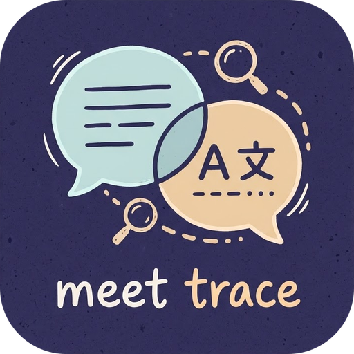

<p align="center"></p>

<h1 align="center">Meet Trace</h1>

**開會聽不清、跟不上外語？Meet Trace 幫你把 Google Meet 與 Microsoft Teams 的字幕即時翻譯、完整記錄下來。**

免費、不需要任何 API 金鑰，翻譯直接在你的電腦上完成，會議內容不會傳到任何伺服器。

---

## ✨ 為什麼用 Meet Trace

- **即時翻譯，完全免費**：使用 Chrome 內建的裝置端翻譯，不用註冊、不用付費、不用 API 金鑰。
- **邊講邊翻**：對方還在說話時，譯文就會跟著更新，不必等整段講完。
- **會後不漏字**：每場會議的字幕、翻譯、聊天與筆記都會自動存檔，隨時回顧、搜尋、匯出。
- **一鍵交給 AI**：「複製全部對話記錄」可直接貼給 ChatGPT、Claude 等，整理會議重點。
- **隱私優先**：所有資料只存在你自己的瀏覽器裡。

## 🧩 功能一覽

### 會議中
| 功能 | 說明 |
|---|---|
| 字幕浮動視窗 | 可拖曳、縮放、最小化，不擋住會議畫面 |
| 自動開啟字幕 | 加入會議後自動幫你打開 CC 字幕（Meet：CC 按鈕；Teams：Alt+Shift+C 或選單） |
| 即時翻譯 | 原文與譯文左右對照，滑鼠指到哪一句，兩邊同一句一起反白 |
| 依發言人分段 | 跟 Google Meet 一樣，同一個人連續講的話顯示成一段；也可改成依停頓分段 |
| 會議筆記 | 邊開會邊記重點，跟字幕一起存檔 |
| 複製全部對話記錄 | 一鍵複製整場會議的「時間 + 發言人 + 內容（+ 譯文）」 |

### 會後
| 功能 | 說明 |
|---|---|
| 會議紀錄頁 | iOS 風格介面，依日期整理，可搜尋標題、發言人或內容 |
| 匯出 | CSV / TXT；一鍵複製全部對話記錄，或複製摘要提示詞（跟隨介面語言）貼給 AI |
| 備份與還原 | JSON 備份，換電腦也能帶走；本機最多可存 25 MB |

### YouTube 逐字稿
在 YouTube 影片頁點擴充功能圖示，一鍵讀取帶時間戳的逐字稿，可以：
- 全部複製，或連同「翻譯提示詞」一起複製給 AI
- 下載成 TXT 或 SRT 字幕檔

### 個人化
- **20 種介面語言**：繁體中文、简体中文、English、日本語、한국어 等，預設跟隨系統
- **4 種配色主題**：極光紫、海洋藍、森林綠、夕陽橘
- **可調整**：字幕字體大小、停頓多久開新段落、翻譯更新頻率、是否自動開啟

## 🌐 支援平台

| 平台 | 字幕擷取 | 自動開字幕 | 聊天紀錄 |
|---|:---:|:---:|:---:|
| Google Meet | ✅ | ✅ | ✅ |
| Microsoft Teams（網頁版） | ✅ | ✅ | — |
| YouTube | 逐字稿讀取 | — | — |

> Teams 桌面版應用程式無法安裝瀏覽器擴充功能，請使用 Chrome 開啟 Teams 網頁版。

## 🚀 開始使用

1. 安裝擴充功能後，點右上角的 Meet Trace 圖示 →「開啟設定」
2. 在「翻譯」選擇 **會議語言** 與 **翻譯成**，按「下載」翻譯模型（只需一次）
3. 加入 Google Meet 或 Teams 會議，字幕視窗會自動出現
4. 在字幕視窗打開「翻譯」開關，即可看到即時譯文

**系統需求**：桌面版 Google Chrome 138 以上（需要 Chrome 內建翻譯功能）。

## 🛠 從原始碼安裝（開發者）

```bash
pnpm install
pnpm build        # 或 pnpm dev：開發模式，修改後自動重新載入
pnpm zip          # 打包成可上架 Chrome 線上應用程式商店的 zip
```

1. 開啟 `chrome://extensions/`
2. 開啟右上角「開發人員模式」
3. 點「載入未封裝項目」，選擇 `dist/meet-trace` 資料夾

技術：WXT、React 19、TypeScript、Tailwind CSS v4、Chrome Translator API。

## 🔒 隱私

- 字幕、翻譯、筆記與設定都只存在你的瀏覽器（`chrome.storage.local`）。
- 翻譯由 Chrome 在你的電腦上執行，不會把會議內容傳到任何伺服器。
- 只有在你按下「複製」時，內容才會放到你的剪貼簿；擴充功能不會自行把內容送到任何網站。

## 授權

本專案以 MIT 授權釋出，部分程式碼依 MIT 授權取得；相關著作權聲明保留於 [LICENSE](LICENSE)。
